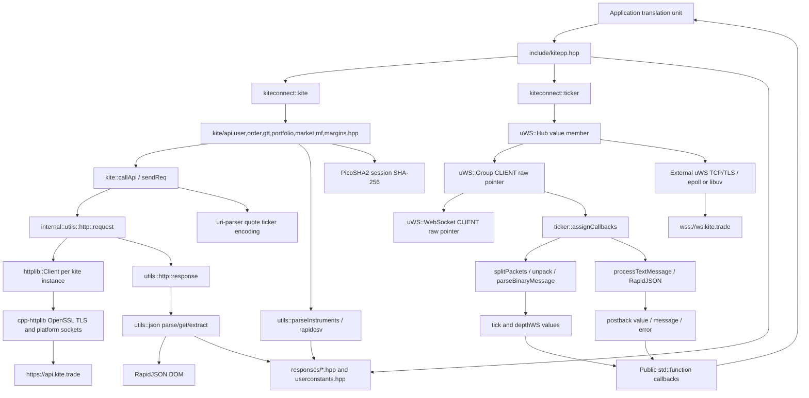
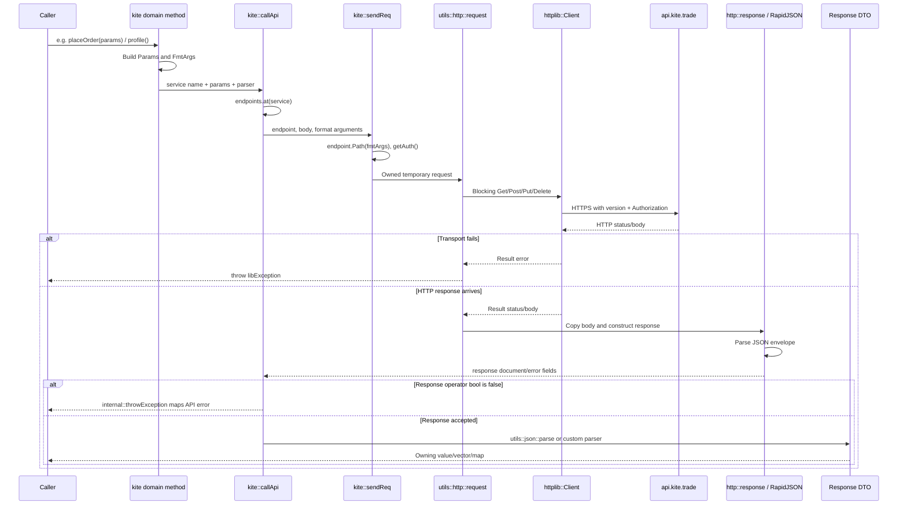
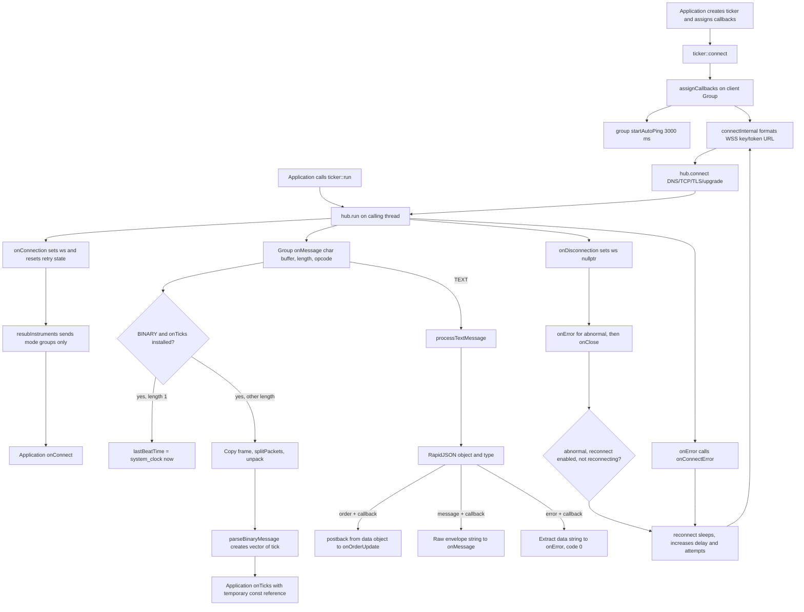
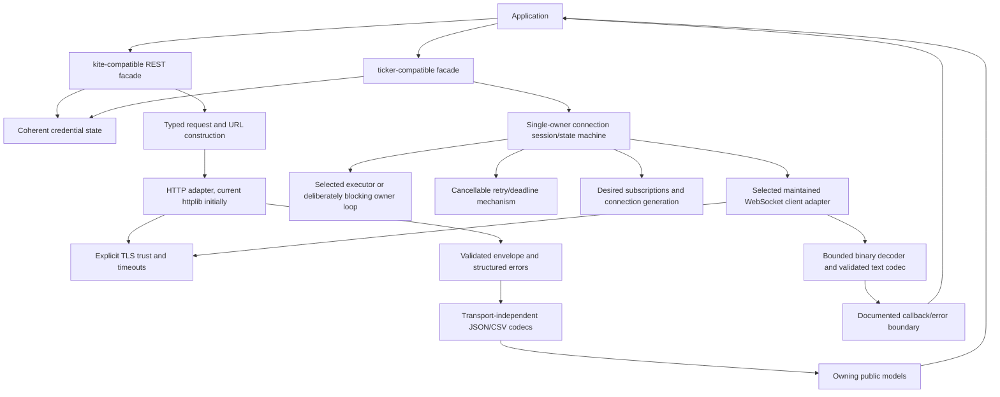
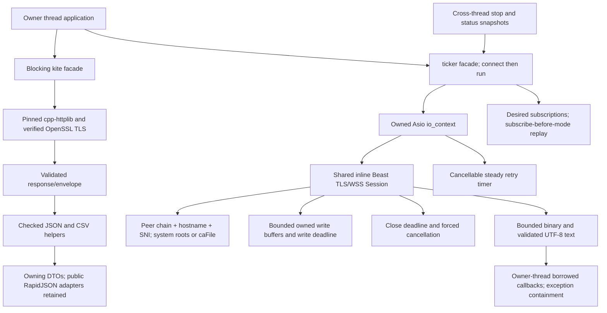
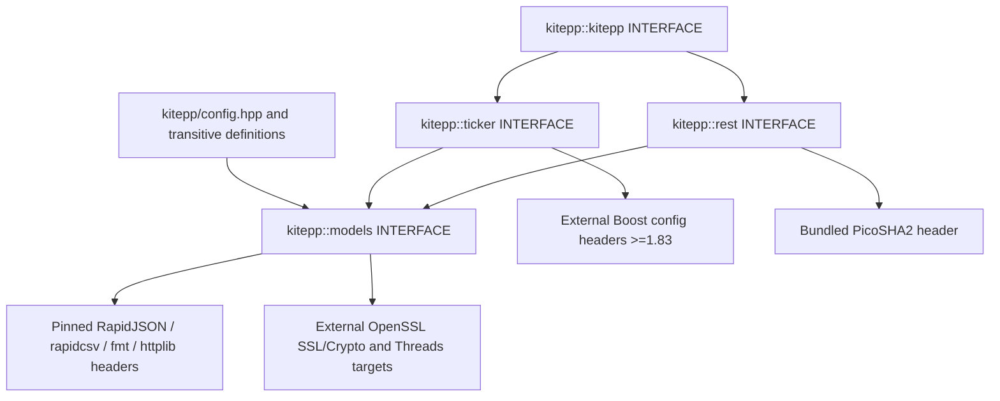

# cppkiteconnect — Current Architecture

**Inspected revision:** `d437b35300bfd13f9de10632aeb19410720c8ad7`  
**Audit date:** 2026-10-05  
**Scope:** sections 1–17 preserve the baseline/Phase 1 architecture and proposals.
Section 18 and subsequent migration updates describe the current implementation
and supersede historical uWS/runtime statements. Sections labeled
**Future**/**Recommendation** remain proposals. Detailed findings and historical
upstream references are in [audit_report.md](audit_report.md).

**Location convention:** abbreviated SDK paths such as `kite.hpp`, `kite/...`, `ticker/...`, `responses/...`, `utils.hpp` and `exceptions.hpp` are relative to `include/kitepp/`; other project paths are root-relative.

## 1. System Overview

### Current

cppkiteconnect is a header-only C++ SDK exposing two independent clients in namespace `kiteconnect`:

1. **`kite`** — blocking synchronous REST facade. Owns credentials, cached authorization, endpoint descriptors and one `httplib::Client` connected logically to the fixed API root.
2. **`ticker`** — callback-driven streaming facade. Owns a `uWS::Hub` by value; stores pointers to a separately allocated client Group and current WebSocket, desired subscriptions, retry state and timestamps. The application calls `connect()` then `run()`; `run()` runs the uWS event loop on the calling thread.

JSON/CSV/binary decoding constructs owning response structs. There is no process-wide SDK service, database, background request worker, shared session store, logging framework, coroutine scheduler, or library-created event thread. REST and streaming clients do not share an authentication object, transport, executor or consistent error channel.

### Current — component architecture



`internal::utils` is not a separate compiled library; it is a collection of inline functions/templates in `include/kitepp/utils.hpp`. Dependency nodes represent the code actually included/called, not independently registered service objects.

## 2. Repository Structure

### Current

```text
include/kitepp.hpp                  Supported umbrella, REST + ticker composition
include/kitepp/rest.hpp              REST-only public header
include/kitepp/kite.hpp             REST declaration, endpoint/state storage
include/kitepp/kite/*.hpp           Inline REST methods and request orchestration
include/kitepp/ticker.hpp           Streaming include aggregation
include/kitepp/ticker/ws.hpp        ticker declarations/state/callbacks
include/kitepp/ticker/internal.hpp  Streaming lifecycle, codecs, dispatch
include/kitepp/responses/*.hpp      Public request/response structs and parsing
include/kitepp/utils.hpp            JSON, HTTP, CSV, formatting, endian utilities
include/kitepp/exceptions.hpp       API/library exceptions and mapping
include/kitepp/userconstants.hpp    String constants for domain options
include/{cpp-httplib,fmt,rapidjson,rapidcsv,PicoSHA2,uri-parser}/
                                   Pinned upstream Git submodules
tests/unit/kite/*.cpp               50 REST cases (happy-path + phase-one characterization)
tests/unit/tickertest.cpp           One full-packet decoding case
tests/unit/{kitepp,utils}.hpp       REST mock seam/fixture loading
tests/unit/test_paths.hpp            CMake-provided fixture path resolution
tests/compile/                        Header-only consumer compile checks
tests/mock_custom/                 Synthetic JSON/binary fixtures
tests/mock_responses/              Pinned Zerodha fixture submodule
examples/example{1,2,3,4}.cpp       Session example, commented snippets, ticker demos
CMakeLists.txt                     Executable/doc targets; no SDK target
deps/CMakeLists.txt                Independent archive downloader only
cmake/modules/FindGMock.cmake       Legacy external GMock discovery
cmake/templates/Doxyfile.in         Optional docs configuration
docs/{mainpage.md,header.html}      Narrative/custom Doxygen template
docs/doxygen-awesome-css/          Pinned documentation theme
.github/workflows/...              Ubuntu/macOS build/test bootstrap
Dockerfile                         Fedora example image/uWS bootstrap
```

There are no first-party SDK `.cpp` library implementation files, root Makefile, benchmark subsystem, package-manager manifests, persistent storage or generated API binding layer. Upstream submodules contain their own test/build assets but root CMake does not build them. The only generated project artifacts described by root CMake are executable build files, compile database and optional docs in the selected binary tree.

## 3. Major Components

### Current

| Component | Actual definition | State / responsibility |
|---|---|---|
| REST facade | `kite.hpp:48-728`; `kite/*.hpp` | Endpoint selection, request parameters, auth, synchronous orchestration |
| Endpoint descriptor | `utils.hpp:415-437` | Method, runtime-format path, request/response content type |
| HTTP request | `utils.hpp:477-559` | Temporary owned path/auth/Params/JSON string, httplib call |
| HTTP response | `utils.hpp:439-475` | Status, error flags/type/message, owning JSON Document or raw body |
| JSON utilities | `utils.hpp:104-390` | Typed getters/extractors, custom parsing functions, DOM writing |
| CSV utility | `utils.hpp:582-596` | Full CSV materialization and per-row DTO construction |
| Streaming facade | `ticker/ws.hpp:66-284`; `ticker/internal.hpp` | Hub/group/socket, callbacks, reconnection and subscription state |
| Binary parser | `ticker/internal.hpp:215-355` | Big-endian integer decoding, packet splitting and tick construction |
| Data model | `responses/{user,order,gtt,portfolio,market,mf,margins,ws}.hpp` | Public mutable owning values, request fluent setters and JSON/CSV parse methods |
| Error mapper | `exceptions.hpp:222-268` | API `error_type` string to named exception |
| Constants | `userconstants.hpp:41-102` | Namespace string objects for modes/products/order types/etc. |

## 4. Component Responsibilities

### Current — REST facade

`kite` declares all user/order/GTT/portfolio/market/MF/margin operations in one class. It stores fixed root/version/login format and a const unordered_map of endpoint names to `utils::http::endpoint`. The map is constructed per instance, not shared globally (`kite.hpp:630-710`). Domain implementations are grouped in separate inline headers but not separate objects. Its protected `sendReq` is now virtual in the ordinary production class definition, providing a stable mock seam without a test-only macro.

`callApi<Res, Data, UseCustomParser>` uses a template-selected JSON shape and optionally a `std::function` custom parser. Collection methods typically supply lambdas that loop over JSON elements into vectors/maps. The template's custom parser does not constitute an asynchronous callback: it runs synchronously while the response document is alive (`kite/internal.hpp:75-86`).

### Current — streaming facade

`ticker` is both transport owner/wrapper and application-protocol parser. Its Group event handlers update connection state and directly invoke public writable callback fields. `isConnected()` means only `ws != nullptr`. `subbedInstruments` stores per-token desired mode; it does not track acknowledgement, connection generation, pending writes or last successful subscription.

### Current — models and utilities

Model structs embed parsing in constructors/`parse` and expose fields without getters/invariants. Request structs use `GENERATE_FLUENT_METHOD` to assign fields and return `*this`. `utils.hpp` connects HTTP and codecs; model includes therefore also include transport/CSV/formatting code. No JSON schema layer, independent binary view type, serializer trait registry or transport-neutral error record exists.

## 5. Dependency Relationships

### Current

The umbrella enables `CPPHTTPLIB_OPENSSL_SUPPORT` before including SDK headers (`kitepp.hpp:36`) and includes REST plus ticker unconditionally. `rest.hpp` provides the REST-only public entry point and also enables the httplib TLS macro. `utils.hpp:38` defines `FMT_HEADER_ONLY`; formatting implementation is compiled in each consumer translation unit. These macros are part of the effective build configuration and depend on consistent header inclusion across TUs.

| Path | Dependencies actually involved |
|---|---|
| REST session generation | fmt → PicoSHA2 → httplib Params → cpp-httplib → OpenSSL/socket → RapidJSON → userSession |
| REST form operations | optional fields → std::to_string → httplib Params → POST/PUT → JSON envelope → DTO |
| REST quote operations | uri-parser for symbol ticker component → fmt query → GET → JSON map → quote DTO |
| REST margin operations | RapidJSON request DOM → serialized JSON passed through one Params pair → POST → JSON DTO |
| REST instrument operations | GET raw response → rapidcsv Document → string row vector → instrument/mfInstrument |
| Streaming | external uWS Hub/Group → platform/backend + OpenSSL/zlib → binary parser or RapidJSON text → callback |
| Tests | GTest/GMock + same included SDK/dependencies; no test fake of uWS lifecycle |
| Docs | Doxygen + theme CSS/JS; no runtime dependency |

libuv is a possible uWS backend/link dependency, not an SDK-owned event loop abstraction. CMake's presence-based discovery does not prove the external uWS build selected that backend. No SDK call uses a libuv API directly.

## 6. REST Request Flow

### Current — normal JSON API request



Evidence: domain methods in `kite/*.hpp`; endpoint formatting `utils.hpp:424-431`; request assembly `kite/internal.hpp:61-73`; send `utils.hpp:480-549`; envelope `:458-473`; result `kite/internal.hpp:79-85`.

**Current details:**

- Constructor sets default `X-Kite-Version: 3`; individual requests add cached `Authorization`.
- POST/PUT are form-encoded unless the endpoint declares JSON. JSON bodies are stored as the second value in the first Params pair; `sendReq` reads `body.begin()->second` (`kite/internal.hpp:64-68`). Public margin methods provide that pair, but the internal convention is not a robust general request type.
- Paths use fmt dynamic argument stores and `vformat`. No separate query map/builder exists. Quotes pre-encode only the ticker substring after `exchange:`.
- Successful result objects own data; no public HTTP response/status/headers are returned alongside DTOs.
- Non-200 JSON response parses status/error_type/message. HTTP-200 envelope status is not validated.
- There is no SDK automatic retry, connection pool or concurrent-request scheduler. httplib serializes its own sends and keep-alive remains at default false.

### Current — bypass flows

`getInstruments` and `getMfInstruments` call `sendReq` directly using non-JSON response descriptors, return `{}` on false response, and parse `rawBody` with rapidcsv. `invalidateSession` calls `sendReq` directly and returns response bool, not parsed `data` or mapped API error. `convertPosition` uses normal `callApi<bool,bool>` and extracts boolean data. These differences are important to the existing error contract.

## 7. WebSocket Flow

### Current — setup, messages and dispatch



Evidence: `ticker/internal.hpp:81-97,169-213,357-430`.

### Current — subscription commands

`subscribe(tokens)` builds action/list JSON, calls `ws->send`, and writes DEFAULT_MODE=QUOTE to every token in `subbedInstruments`. `unsubscribe(tokens)` sends then erases tokens. Both throw `libException` if disconnected. Due the current string-literal encoder defect they send a null action; this diagram models the actual command code, not successful server subscription.

`setMode(mode,tokens)` creates RapidJSON request explicitly, sends it if connected, and records LTP/QUOTE/FULL. Any string other than `ltp`/`quote` is stored as FULL although the original string is sent. The SDK does not verify send acceptance/server acknowledgement, supply a bounded write queue, or validate server subscription limits. Replay uses only setMode, relying on undocumented server behavior rather than explicit subscribe-before-mode.

### Current — binary layout

`splitPackets` reads a two-byte packet count, then repeated two-byte lengths and packet copies. `unpack<T>` copies/reverses a range and memcpy-loads T. Recognized payload sizes are 8 (LTP), 28/32 (indices quote/full), 44 (tradable quote), and 184 (full with ten 12-byte depth entries). Segment low-byte chooses currency divisor 10,000,000, BSECDS 10,000, otherwise 100. Values become public tick fields with sentinel defaults.

There are no application length/count/type guards before low-level reads. A packet with unrecognized size is still appended as a partial sentinel tick after token decoding. Percentage netChange for tradable quote divides by close; index netChange directly uses the price-change field, so units differ. No second parser thread/offload exists.

## 8. Authentication Flow

### Current

1. `kite(apikey)` stores key and constructs the HTTPS client; no token is automatically set.
2. `loginURL()` returns fixed-format browser login URL containing key. Application/user performs login outside SDK and supplies request token.
3. `generateSession(requestToken,apiSecret)` computes `PicoSHA2::hash256_hex_string(key + requestToken + apiSecret)` and POSTs api_key/request_token/checksum to `/session/token`.
4. Parsed `userSession` contains profile, userTokens, apiKey/publicToken/loginTime. The method **does not** set the client's token or authorization.
5. Caller invokes `setAccessToken`, which stores token and caches `token key:token`. Later `setApiKey` does not rebuild that cached authorization.
6. `invalidateSession()` sends DELETE with key/token query parameters and returns response success flag. It does not clear local credentials.
7. Streaming application separately supplies `ticker` key/token. `connectInternal` interpolates both in `wss://ws.kite.trade/?api_key=...&access_token=...`; no shared state/session update exists between clients.

Evidence: `kite/api.hpp:36-69`; `responses/user.hpp:83-116`; `ticker/internal.hpp:64-79,169-171`; `ticker/ws.hpp:223-226`.

### Finding

Session signing itself matches the official protocol. Ordinary request authorization is bearer-like token identification rather than a fresh checksum/signature on every request. WebSocket certificate validation is absent in the documented legacy backend inspected during the audit; REST has independent certificate/hostname validation. Parsing the WebSocket `postback.checksum` is not webhook-signature validation and there is no inbound HTTP webhook server in this repository.

## 9. JSON/Data Flow

### Current

| Source | Transformation | Result/lifetime |
|---|---|---|
| HTTP JSON body | `http::response::parse` → `json::parse(Document,string)` | Document owns pool until call returns |
| Envelope `data` | `extractObject/Array/Bool` | RapidJSON borrowed view or scalar; no schema guard |
| Scalar members | templated `get` type branches | Copy string/numeric/bool or missing default; type errors throw |
| Nested models | `get<JsonObject, Model>` | Construct owned Model while view lives |
| Nested arrays | `get<JsonArray>(val, out, name)` | Moves source array into temporary Value; parses consuming view |
| Collection result | Domain custom parser lambda | Own vector/map, often no reserve |
| CSV body | stream → rapidcsv → row vector → positional parse | Copies strings/numerics into instrument values |
| WSS text | object `type`, `data` → postback/string callback | Document local; callback value borrowed temporarily |
| WSS binary | packet copies/field temporary vectors → tick/depth | Owned returned vector, borrowed during onTicks |

Public DTO `parse` methods expose RapidJSON object/array types; documents do not escape normal REST return values. “const object view” does not guarantee a const underlying DOM: nested extraction can empty source arrays. Public collection parsers append rather than consistently replace if called again with a new document. Exception midway through parsing can leave partially updated fields.

Missing member lookup returns value-initialized zero/empty instead of preserving numeric -1 sentinels; string null becomes empty. Double lookup rejects integer representations outside signed 32-bit even if a JSON number fits double. No centralized validation/range/precision policy exists. All dates remain strings except ticker's signed 32-bit epoch values. Required request numeric members are not universally default-initialized.

## 10. Error Propagation

### Current

```text
httplib failure
  -> stringified transport cause -> libException -> synchronous caller

non-200 JSON response
  -> response.error + errorType/message
  -> callApi -> internal::throwException
  -> token/user/order/input/network/data/general/permission/unknownException

CSV non-200 response
  -> response false -> empty instrument vector

session invalidation response
  -> response bool -> true/false (normal API exception mapping bypassed)

malformed JSON
  -> libException containing raw body

missing/wrong envelope object or array element
  -> RapidJSON assertion / unchecked access rather than catchable SDK error

scalar type mismatch
  -> libException formatter (currently static dangling-reference bug)

numeric CSV conversion
  -> standard invalid_argument/out_of_range can escape

stream failure / abnormal disconnect
  -> onConnectError / onError / onClose -> possible reconnect

stream parse error or user callback exception
  -> exception escapes uWS handler; no explicit containment policy
```

`kiteppException` correctly carries code/message with derived const-noexcept what functions. Separate `libException::what()` is non-const/non-noexcept and does not override the base; standard exception catches lose its text. There is no uniform structured error category, transport error_code, Retry-After exposure, or asynchronous result channel.

HTTP status 200 skips envelope error classification; unknown error type strings lose status context when mapped to generic libException. A raw instrument empty vector can therefore mean either valid empty data or an HTTP failure, unlike most REST operations.

## 11. Concurrency Model

### Current — owner thread and synchronization

The caller chooses the thread executing `hub.run`. Group events, decoder work, retry sleep and public callbacks execute inline there. uWS contains backend timers and socket operations, but the SDK does not own a thread or queue. `connectInternal` invokes external setup including synchronous DNS; established connections use uWS asynchronous dispatch. `isReconnecting` is the only SDK atomic.

| Operation | Existing guarantee |
|---|---|
| Single-threaded REST sequential calls | Ordinary synchronous behavior; DTO results own storage |
| Concurrent REST sends, fixed credentials | httplib serializes internal sends; no SDK-level full thread-safety promise |
| REST setters concurrent with requests/getters | Unsynchronized credentials/header state; unsafe |
| Ticker methods/callbacks on one owner thread | Matches examples; reentrancy possible, lifecycle weaknesses remain |
| Ticker `stop/subscribe/setMode/getters` from another thread | No dispatch or protection; ws/map/timestamps can race |
| Callback registration during dispatch | Writable std::function field races; no synchronization |
| Destroy ticker while run/operations remain | No cancel/join/lifetime contract; unsafe |

No locking strategy or lock ordering is implemented in SDK code. The external httplib mutex and optional external uWS thread-safe flags cannot make SDK mutable containers/pointers safe. Timer callbacks/reconnect requests are not marshaled through a dedicated command queue. C++20 jthread would only manage a deliberately introduced worker lifetime, not solve socket-state races.

## 12. Memory Ownership Model

### Current

| Resource | Actual ownership | Release/lifetime behavior |
|---|---|---|
| kite object | Application stack/heap | Automatic member destruction; no explicit virtual destructor contract |
| httplib client | Value member, internally unique implementation | Transport destructor owns internal socket/TLS cleanup |
| HTTP request/body/auth | Temporary owning strings/Params | Freed when sendReq temporary/call finishes |
| Response DOM | Automatic `http::response` | RapidJSON allocator/document destroyed after conversion |
| Response DTO values | Returned owning strings/vectors/maps | Caller-owned; no intended DOM pointer retention |
| ticker Hub | Value member | External Hub destructor frees its own buffers/context/node |
| created Group | Raw pointer from `hub.createGroup` | Caller-allocated in inspected backend; SDK never closes/deletes it |
| current WebSocket | Borrowed raw pointer managed by uWS | Set on connection, nulled on disconnect; cannot be retained externally safely |
| Group handler closures | Stored by Group, refer to ticker this | Require ticker/Hub lifetime; no weak/session guard |
| onTicks arguments | Reference to returned temporary vector | Valid for current callback invocation only |
| order/text/error arguments | References to temporaries/local strings | Valid for callback invocation only |
| json error closure | Static captures first call's `name` reference | Confirmed dangling stack reference after first call |

No project explicit new/delete syntax appears, but uWS `createGroup` transfers an allocation obligation. The inspected Hub implementation does not own a registry that deletes those groups. Repeating auto-ping belongs to Group and remains active when the wrapper closes only a socket. Proper deletion requires event-loop shutdown/drain ordering, not merely replacing pointers with smart pointers.

`stop()` closes a connected socket only; it does not release Group, stop auto-ping, cancel connecting/backoff state, or establish that no more callbacks can touch the ticker. Callback code must not destroy the ticker mid-dispatch under the current implementation. Client move/copy semantics are implicit/mostly unavailable due member types and should not be inferred as transferable session ownership.

## 13. Build/Dependency Architecture

### Current

There is **no SDK CMake library target**. Consumers copy the include tree and manually arrange external dependencies. Root CMake globally adds SDK include paths and C++17, discovers system binary dependencies only for examples/tests, and creates executables. Default configuration compiles no SDK header.

| Target | Build inputs | Declared links |
|---|---|---|
| example1–4 | One `.cpp` each, supported umbrella | Threads, OpenSSL SSL/Crypto, ZLIB, uWS, optional/required UV |
| kiteTest | Glob `tests/unit/kite/*.cpp`, stable virtual `sendReq` seam | OpenSSL, GTest/GMock legacy variables, Threads; REST-only headers |
| tickerTest | `tickertest.cpp` | OpenSSL, ZLIB, uWS, optional/required UV, GTest main, Threads |
| docs | Configured Doxyfile + SDK headers/mainpage/examples | Doxygen process and theme assets |

`tests/unit/main.cpp` is not compiled into the REST target; externally linked test-main supplies entry point. Runtime fixtures use the CMake-defined source test directory and no longer depend on the process cwd. The mocked REST class uses the same production `virtual sendReq` definition as ordinary clients. Installed/exported package targets do not yet exist.

Gitlinks pin six header library trees, fixtures and theme; OpenSSL/uWS/zlib/libuv/GTest are externally discovered. CI/Docker build external uWS via Make. Linux follows hoytech master, macOS follows v0.14.8; root CMake does not enforce either revision. The separate deps CMake downloads old archives with hashes but is not a package builder/manager and writes under source-derived paths. C++ compiler minima/architecture constraints are not specified; Windows CI is commented out.

## 14. External Interfaces

### Current

- **Consumer C++ interface:** umbrella `kitepp.hpp`; `kite` methods; `ticker` methods/callback fields; public DTOs/request params, exceptions and string constants.
- **REST service:** `https://api.kite.trade`, version header 3, token Authorization, endpoints embedded in `kite.hpp`. Methods cover session/user/orders/GTT/portfolio/quotes/history/MF/margins. Unused endpoint descriptors include market margin/trigger-range paths; an endpoint map is not proof of an exposed public method.
- **Interactive login:** browser URL on `https://kite.zerodha.com/connect/login`; application obtains request token externally.
- **Streaming service:** `wss://ws.kite.trade/` with key/token query, JSON commands and text messages, binary market ticks/heartbeats.
- **Operating system:** platform socket/DNS/CA roots via transport; pthread/event backend/libuv external implementation details.
- **Examples:** `KITE_API_KEY`, `KITE_API_SECRET`, `KITE_ACCESS_TOKEN`; Docker's `EXAMPLE_NUMBER`; no SDK automatic environment loading.
- **Testing:** offline JSON/CSV/binary fixtures; CTest executes two programs; no live-server requirement in tests.
- **Build/docs:** manually copied headers/external link libraries; optional Doxygen output. No package discovery interface, ABI version or SDK release artifact is produced by CMake.

The current public API has no configurable service root, proxy, CA bundle, REST deadline, custom executor, request retry policy, bounded queue or transport interface. External errors are transformed into exceptions or callbacks without preserving all response headers/network details.

## 15. Architectural Problems

### Finding — evidence-linked summary

| Problem | Implemented boundary/evidence | Report finding |
|---|---|---|
| C++20 runtime-format compilation | `kite/api.hpp:45`, `ticker/internal.hpp:170`, fmt consteval | F05 |
| Monolithic utility/dependency coupling | `utils.hpp`; public RapidJSON constructors | F06 |
| Mutable inconsistent auth state | key/token/cached auth, setter behavior | F08 |
| Subscription serializer mismatch | scalar field writer ignores literal type | F11 |
| Incomplete replay | mode-only resubInstruments | F12 |
| Blocking retry and unsafe shutdown | sleep_for in Group callbacks, socket-only stop | F13/F14 |
| Parser trust/lifetime | unchecked application lengths/types, static capture, consuming DOM | F16/F17/F19 |
| Unowned Group/callback/timer state | raw createGroup pointer, no destructor | F22 |
| Missing concurrency contract | only reconnect flag atomic | F23 |
| Fragmented errors | exceptions, bool/empty, assertions and callbacks | F24/F25 |
| WSS trust gap | default external uWS context lacks verification | F26 |
| Narrow tests/different class layout | mocked sendReq, fixed cwd, one full tick test | F28 |
| No distributable usage requirements | no target/install/export; unpinned binary backend | F01–F04 |
| Allocation-heavy tick decoder | frame/packet/per-field vectors and final copies | F29 |
| Platform-dependent URL byte encoding | uri-parser signed-char arithmetic; quote ticker encoding | F31 |

These are existing architecture characteristics. Some defects can be fixed privately while preserving client interfaces; others require explicitly versioned behavior/source changes. Missing tests/unspecified binary backend limit certainty about actual deployed timing and installed-library patches. Local audit checks did not run CTest or a live uWS server because CMake/uWS development tooling was absent.

## 16. Proposed Future Architecture

### Future — proposal only

Preserve the high-level synchronous REST and callback streaming facades initially. Introduce internal boundaries with no claim that these named abstractions already exist:



### Recommendation — constraints for the proposal

1. **Transport:** keep cpp-httplib REST unless asynchronous HTTP is an explicit requirement. Beast/Asio is the primary streaming candidate for preserving an async event loop; current httplib WebSocketClient is a lower-dependency blocking alternative to prototype against identical acceptance tests.
2. **Ownership:** one session owns socket/timers/buffers; operations extend lifetime only where required. Shutdown cancels pending work, drains safely, and prevents retry. Shared ownership is not an automatic fix.
3. **Concurrency:** callbacks/mutating commands have one declared executor/owner; cross-thread commands are posted, never direct unsynchronized pointer operations. A bounded queue is added only with a clear ordering/overflow policy.
4. **Parsing:** bounded span byte decoder, validated JSON/CSV codecs, explicit numeric/absence semantics; models no longer need transport/JSON types. Preserve old parsing constructors through compatibility adapters if required.
5. **Errors:** preserve endpoint/status/network/schema categories and safe messages. Keep exception facade compatibility; result-returning overloads can be additive. Do not mandate C++23 expected for C++20.
6. **Packaging:** independent exported REST/ticker/model targets with consistent compile features/TLS flags, tested install/add_subdirectory usage, one locked optional dependency strategy.
7. **Authentication:** avoid stale cached headers; define token replacement/logout behavior. Both transports explicitly authenticate server identity. No new crypto library is needed.
8. **Performance:** direct byte loads and reserved outputs after validation, measured tail latency and allocation tests. No modules/coroutine/logging dependencies solely for style.

## 17. C++20 Migration Boundaries

### Recommendation

| Boundary | Can be separated from standard change? | Compatibility notes |
|---|---|---|
| Parser/lifetime/subscription/auth bug fixes | Yes, and should happen first on C++17 | Usually private fixes; errors/wire behavior intentionally corrected |
| Build target/package redesign | Yes, before enabling C++20 | Additive targets; higher CMake minimum removes old tooling support |
| Dependencies/TLS support refresh | Yes, one at a time | Rebuild consumers; external C ABI/backend configuration must match |
| fmt fixed/runtime string integration | Required before/during C++20 | Private source change; current usage demonstrably fails |
| span/endian/concepts | C++20-only implementation improvements | Keep owned async buffers; std::byteswap is C++23, so use local bounded endian logic |
| Strong public DTO types/optional/time model | Independent major-version API work | Definitely source/layout breaking if existing fields are replaced |
| Async networking state machine | Independent architecture/security work | Preserve or document callback ordering/affinity, cancellation and borrowed lifetimes |
| JSON replacement | Independent after codec separation | Public RapidJSON signatures currently make this breaking |
| Coroutines/modules/std::format | Optional later | Requires separate compiler/stdlib/build support rationale; not readiness requirements |

**First step before migration:** recover a deterministic C++17 build/test baseline and add regression/acceptance tests for F17, F16, F11, F08, F20 and the TLS/stop/reconnect contracts. Then implement safety/security corrections, establish targets/dependency boundaries, and enable C++20 as a distinct change with wire/model/callback parity evidence. The current architecture needs stabilization more urgently than a wholesale syntax rewrite.

**Current audit state:** Phase 1 implementation changes are recorded in `audit/migration_log.md`. The SDK remains C++17, header-only, and backed by the legacy external uWS transport. Architecture conclusions are tied to inspected files/symbols; external uWS implementation claims refer to official documented source revisions listed in the report, not a locally tested production binary.

## 18. Migration Progress

### Implemented — Phase 1 protection boundary

- REST-only public inclusion is available through `include/kitepp/rest.hpp`.
- The umbrella remains header-only and composes the REST and ticker implementations.
- The `kite` mock seam is stable across ordinary and test translation units because `sendReq` is always virtual; the old `KITE_UNIT_TEST` layout switch is removed.
- Fixture resolution is independent of the process working directory through `KITE_TEST_DATA_DIR`.
- C++17 consumer compile checks cover REST-only, ticker-only, umbrella, standalone-header, and multi-translation-unit use.

### Current / Implemented — Phase 2



All implementations remain in headers. No uWS/libuv code or Group pointers
remain in the ticker. `ticker/session.hpp` owns resolution, TLS stream, buffers,
connect/write/close deadlines and queue. Asynchronous handlers retain session
ownership; the facade must outlive its drained owner loop. Destructor cancellation
is for quiescent ownership, not concurrent deletion. Copy/move are disabled.

The public facade/callback signatures remain; `tickerOptions` is additive.
`setMode` now requires prior subscription, as updated in runnable examples.
Normal and policy close are terminal; remote close codes are preserved. TLS and
authorization upgrade failures do not retry. Retry does not block callbacks.

REST retains its fixed service root and no new public transport options. Cached
authorization follows key/token replacement. JSON/CSV/binary/text boundaries are
checked; DTO collection reparsing no longer consumes source arrays. Missing scalar
defaults and public JSON signatures are retained, not a completed codec/model
decoupling. The legacy internal transfer helper remains explicitly documented.

Offline CTest now runs REST/protection, binary/text, and local lifecycle/TLS suites.
Both repository-child and external trees pass, as do independent header consumers
and ASan/UBSan including leak checking. TSan cannot start even for an empty process
on this host. See the journal and `docs/runtime_contract.md` for the exact limits.

### Planned / Remaining

- Phase 3: package targets/install/export, actual component closures, uniform
  configuration, clean external and relocated consumption, bootstrap/CI.
- Phase 4: independently refresh REST/fmt/CSV/test dependencies and qualify the
  selected transport/provider policy. No vendored gitlinks were changed in Phase 2.
- Phase 5: C++20 and compiler/stdlib matrix; SDK still uses C++17.
- Phase 6: explicitly deferred breaking model/parser/result interfaces.
- Phase 7: measured optimization and complete documentation/release qualification.
- General REST final-path/date encoding, configurable REST network policy,
  transport-independent models and all-platform coverage remain open.

## 19. Current / Implemented — Phase 3 Packaging



The shared include root contains the bundled providers, including REST's SHA
dependency. Models still include HTTP/CSV utilities and need their actual closure.
`KITEPP_ENABLE_TICKER=OFF` avoids Boost; installed REST/model component discovery
also avoids it in a full install. Separate core/ticker exports contain only
relative SDK paths and named external targets, not build-machine library paths.

Default top-level builds compile a smoke consumer; tests/examples/docs are opt-in.
Each first-party header can be checked in a separate generated validation TU;
implementation fragments now include their required private REST definitions.
Manual, add_subdirectory and relocated find_package consumers, including mixed
REST/ticker include-order multi-TU programs, pass. All SDK targets are INTERFACE;
no SDK object archive/shared library/implementation source is installed.

Configuration verifies bundled representative-header hashes and clean gitlink
identities when metadata is present, without downloads/source mutation. Required
headers/licenses are bundled in the install. CI has migration push/PR triggers,
old/current CMake, GCC/Clang/macOS and sanitizer lanes; only local GCC/Linux lanes
are currently executed. Docker's digest-pinned Ubuntu bootstrap uses system
packages and builds successfully without Git metadata/uWS source downloads.

Remaining: Phase 4 independent dependency updates, Phase 5 C++20/platform release
matrix and Phase 7 consolidated examples/docs/performance. Phase 6 remains
explicitly deferred; a package export does not decouple the public DTO parser API.

## 20. Current / Implemented — Phase 4 Dependency Boundary

SDK remains C++17 at this checkpoint. Bundled REST/fmt/CSV providers are
cpp-httplib 0.59.0, fmt 12.2.0, rapidcsv 9.07. RapidJSON/PicoSHA2 stay pinned.
Tests additionally qualify external GTest/GMock 1.18; previously qualified 1.10
remains a supported config floor. OpenSSL >=3.0 must come from a supported provider;
actual Linux package is Ubuntu's patched 3.0.13-0ubuntu3.16. Platform is 64-bit.

The REST adapter keeps the original sorted parameter type independently of the
provider's insertion-ordered container. It owns final target encoding; client
configuration disables provider normalization once at construction, not during
sends. Forms convert to provider parameters at the boundary. The original wire
goldens—including literal plus, spaces, encoded symbols, headers and JSON—pass.
Runtime fmt strings are explicit. No second WS backend or asynchronous REST
rewrite was added; qualified Beast/Asio remains the ticker.

Individual dependency checkpoints and combined C++17 header/example/wire/TLS/
lifecycle/sanitizer/package tests pass. A CMake 3.18 optional header-check generator
limitation was exposed and fixed with a traditional configured template. Source
copies, model types, JSON compatibility defaults and broader API design remain
unchanged. Next: C++20 with an explicitly selected C++17 rollback configuration;
cross-platform and release/performance gates still remain open.

## 21. Current / Implemented — Phase 5 C++20 Checkpoint

The default target contract now propagates `cxx_std_20`; repository executables
require the selected standard with extensions disabled. Explicit
`KITEPP_CXX_STANDARD=17` exports `cxx_std_17` and `KITEPP_CPP17_COMPAT=1` for the
protected rollback. Configuration checks the language mode, including MSVC's
`_MSVC_LANG`. Downstream TUs must use consistent language/provider/feature
configuration and be fully rebuilt after changes; installs use separate prefixes.

C++20 binary data flows through checked `span<const char>` frame/packet views,
constrained integral non-bool field decoding, `std::endian` decisions and fixed
stack arrays/memcpy. Views stay inside synchronous decode; public tick/depth
values and callback copies remain owning. C++17 retains the tested vector-based
decoder. Retry/liveness already use steady timers; the public heartbeat snapshot
retains its compatibility system-clock type. No modules/coroutines/format/expected
rewrite or strong model/result APIs were added.

CSV number parsing detects floating-from_chars availability. libc++ 18 lacks that
overload, so a classic-locale, no-whitespace stream parses directly to the target
floating type. Whole-decimal-field/finite/range validation is retained; valid
subnormal ERANGE results are handled, zero underflow and malformed suffixes
rejected. Tests cover locale independence and a near-halfway value that would
double-round through a wider intermediate. No global locale mutation occurs in
SDK parsing.

Linux/AArch64 GCC 13.3, Clang 18.1.3/libstdc++ 13 and Clang/libc++ 18 checkpoints
pass, including GCC/Clang ASan/UBSan/leak coverage, single/multi-TU consumers and
C++17 rollback. Minimum-CMake C++20 default smoke/relocation and current-tool
consumption pass. A test-only shutdown timer was corrected to measure from stop,
keeping the peer stalled through setup; the original sanitizer failure and fix
are recorded in the journal.

An opt-in synthetic decoder benchmark compares the same full frames under both
standards. Measured ordinary allocations/frame are 62/940/3728 (C++17) versus
12/170/654 (C++20) for 1/16/64 full packets. Shared-host latency samples are
diagnostic, not production evidence. SDK targets remain INTERFACE; benchmark
sources/executable are validation tooling. Full compiler/OS qualification is
pending, so Phase 5 remains partially completed and Phase 7 release gates are open.

## 22. Current / Implemented — Additional Toolchain and Package Qualification

Ubuntu GCC 14.2 and Clang/libc++ 20.1.2 now pass full C++20 header/example/offline
checks with distro GTest/GMock 1.14. Clang/libc++ 20 also passes ASan/UBSan/leak
coverage and relocated single/multi-TU consumers. GTest is rebuilt against libc++
to avoid mixing standard-library ABIs. These are additional Linux/AArch64
checkpoints, not evidence of other OS/architecture support.

The Ubuntu libc++/libc++abi 18.1.3-1ubuntu1 sanitizer lane fails nested exception
destruction. A standalone program using only stdexcept reproduces the same
operator-new/free mismatch, while the LLVM 20 provider passes unsuppressed. CI
therefore retains 18 normal compatibility checks and uses 20 for libc++ sanitizers;
SDK callback/error code and sanitizer mismatch detection are not weakened.

Installed component selection first determines whether streaming is required.
Required ticker/umbrella uses find_dependency(Boost); optional streaming uses
quiet find_package and imports ticker targets only when the provider is present.
Absent optional Boost leaves core targets usable. This fixes the previously
untested full-package/missing-Boost case; required/unknown failures remain errors.
Minimum/current-CMake, C++17 rollback and C++20 relocated checks pass. Header-only
INTERFACE targets and source/runtime ownership remain the same boundaries.

## 23. Current / Implemented — Phase 7 Local Release and Documentation

User-facing documentation is now aligned with the implementation: C++20 default,
explicit C++17 rollback, Boost.Asio/Beast ticker, OpenSSL trust requirements,
owner-thread callbacks, borrowed callback lifetimes, terminal shutdown,
component/package consumption and known compatibility debt. Historical uWS setup
text was removed from the README and Doxygen mainpage. A release-notes document
and downstream rebuild checklist are installed with the package.

Examples no longer print access tokens and now reject missing credential
environment variables before constructing clients. A dedicated
`kitepp-documented-examples` validation executable compiles the README REST and
ticker snippets without contacting the service. The four live examples and these
snippets build under C++20 and the protected C++17 configuration.

Doxygen input includes the current build/dependency/runtime/release pages and
Graphviz is enabled for class/dependency graphs. Doxygen 1.9.8 plus Graphviz
generates HTML successfully; legacy API comments still produce non-fatal warnings
for repeated example labels and stale parameter names. No SDK implementation was
changed to silence those warnings. The generated documentation is validation
output, not checked into the repository.

The release checkpoint reruns full CTest 9/9, both decoder benchmark modes,
relocated C++20 consumers 6/6, and manual C++20/C++17 header diagnostics. Latest
allocation counts remain 62/940/3728 for C++17 and 12/170/654 for C++20 at 1/16/64
full packets; shared-host timing remains diagnostic only. Installed documentation
contains `release-notes.md`. This completes local Phase 7 work while the declared
macOS/Windows/platform and live-service gates remain open.
